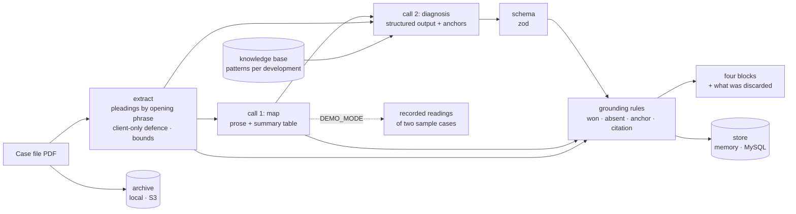

# case-diagnostics

A web app that reads the full PDF of a Brazilian civil case and returns a strategic diagnosis for the defence in four blocks: complexity, risk of the current defence, theses not explored, and replicable improvements. Two model calls do the reading (a free-form map first, a structured diagnosis second); deterministic grounding rules then verify every thesis against the file and discard, with the reason on screen, anything the file does not support. Built as a technical assessment for a firm's real-estate litigation team; rebuilt here in English with a demo, fictional cases and the rules the original only asked of the prompt.

 

**Status:** delivered (technical assessment, live demo for the team); grounding rules, evaluation and tests added in this rebuild · **Runs offline:** yes, the demo needs no key, no database and no bucket

```
$ npm run eval

  caught      [case-a] won_topic            Moral damages: no subsidiary request to reduce the quantum
  caught      [case-a] absent_topic         The 180-day tolerance period for the delay of works (Lei 6.766/79) was never invoked
  caught      [case-a] anchor_not_found     Clause 9.2 waives the buyer's right to withdraw and was never invoked
  caught      [case-a] citation_not_in_file The defence did not answer the plaintiff's reliance on Lei 13.786/2018 for a retention cap
  caught      [case-b] won_topic            Moral damages: the defence relied on generic case law
  caught      [case-b] absent_topic         The property tax (IPTU) borne during the delay was not offset against the award
  caught      [case-b] anchor_not_found     Clause 6.5 caps the compensation at 5% of the price and was never invoked
  caught      [case-b] citation_not_in_file The defence did not answer the plaintiff's reliance on Lei 4.591/64 for the delivery deadline

case     theses genuine planted caught wrong-rule false-drops  sections
case-a       10       6       4      4          0           0  complaint@p1 defence@p3 judgment@p4 appeal@p5 appellate@p6
case-b        9       5       4      4          0           0  complaint@p1 defence@p2 judgment@p4 appeal@p5

planted hallucinations caught by the expected rule: 8/8; genuine theses wrongly discarded: 0
```

The case files are Portuguese because Brazilian courts are; the diagnosis is written in English here and in Portuguese with one setting. Every party, amount and case number in the samples is invented.

## The problem

A litigation team defending a developer in hundreds of similar lawsuits (buyers rescinding lot purchases, delays of works, association fees) wanted, for each file, what a senior lawyer produces in an afternoon: how complex the case is, how exposed the current defence is, which arguments were never made, and which mistakes repeat across the portfolio and should become a checklist. A first version that fed the PDF to a model and asked for the report straight away produced confident nonsense: theses about moral damages in cases where the court had already dismissed moral damages, statutes nobody had cited, clauses that did not exist. The team could not use a report it had to re-read against the file.

## What it does

- Finds the pleadings inside a long case file by the phrases that open them (complaint, the client's own defence, judgment, appeal, appellate decision), keeps each within bounds and tells the user which were read and at which page.
- Maps the case in prose first, ending in a fixed summary table (outcome of every claim, ultra petita, fee increases, defence wins, laws actually argued, absent topics), then writes the four-block diagnosis as a structured output validated against a schema.
- Requires every thesis to carry an **anchor**: an excerpt of the file, quoted verbatim, that makes it applicable. The engine searches the anchor in the file and discards the thesis when it is not there.
- Applies the summary table as code: a thesis on a point the defence already won, or on a topic the file does not contain, or a fact-asserting thesis citing a statute the file never mentions, is discarded with its reason shown, never silently.
- Calibrates the diagnosis with a knowledge base of recurring patterns per development, archives every upload, stores every diagnosis (with the discards) and copies the report as text for a spreadsheet.

## Architecture



`src/lib/pipeline.ts` runs one upload end to end: validate, archive, record, read, extract, analyse, validate, ground, persist. The extractor (`extract.ts`) and the grounding rules (`grounding.ts`) are pure functions over text. The analyzer (`analyzer/claude.ts`) is the only module that calls a model; `factory.ts` is the only module that decides which adapter runs, so the routes and the pipeline never read the environment. The Next.js app is one page, three API routes and an optional password gate.

## Design decisions

- **Two calls, and the second one sees the file.** Reasoning in prose before structuring is what made the first version usable: a model asked for JSON straight from a PDF invents. The original gave the second call only the map; here it also gets the file, because an anchor quoted from a paraphrase cannot be verified. Cost: the file's tokens are paid twice; the stable system prompts are cached.
- **The grounding rules live in code, not in the prompt.** The original told the model "if moral damages were dismissed, never mention them"; it mostly obeyed. Here the summary table is parsed and applied: won topics, absent topics, anchors and citations are checked by functions with tests, and the evaluation plants the four kinds of hallucination in the recorded readings to prove the rules catch them. Cost: a rule is only as good as its matching; a genuine thesis that mentions a won topic in passing is discarded too, which is why nothing is discarded silently.
- **A thesis must quote its evidence.** The anchor is the cheapest contract with the model: ten to twenty-five words copied from the file. It turns "the defence did not raise the lien" from an opinion into a claim the engine can check, and it gives the lawyer the exact place to look. Cost: theses on what is *missing* from a file still need an anchor showing the precondition (the clause that exists, the sentence of the judgment that notes the absence).
- **Pleadings are found, not guessed.** The first version searched five pleadings by keyword and kept the *last* occurrence, so a docket or a judgment that mentions "petição inicial" shifted the section; it also had no section for the judgment, the very place ultra petita is detected. Here each pleading starts at the first occurrence of its most specific phrase, the defence must be near the client's name, sections end where the next begins, and the judgment and the appellate decision are sections of their own.
- **The demo refuses what it cannot vouch for.** In demo mode the analyzer answers from recorded readings keyed by the case number in the file; any other PDF gets a 422 and an explanation, because a demo that fabricates a diagnosis for your upload would demonstrate exactly the failure the product exists to prevent.
- **English product, Portuguese evidence.** The UI, the prompts and the diagnosis are English (Portuguese with `OUTPUT_LANGUAGE=pt-BR`); the opening phrases the extractor looks for and every anchor stay in Portuguese because they must match the file.

## How AI was used

- **Generated:** the original Portuguese version was written with an AI coding assistant in a few days as a technical assessment (May 2026), with a live demo; this English rebuild was produced with the same assistant, and the demo adapters, the two synthetic case files with their recorded readings, the grounding rules and the test suite were introduced in the process.
- **Rewritten by me:** the anti-hallucination rules, which existed only as prompt instructions, became parsed tables and checked anchors; the section finder was redone (first occurrence of the most specific phrase, bounded sections, judgment and appellate sections) after tracing why the first version sent the wrong text; the prompts were restructured so the map's table is a contract the code can read.
- **Validated:** 75 tests run offline, including the route handlers over the rendered sample PDFs; the evaluation plants eight hallucinations across the two recorded readings and requires every one to be discarded by the expected rule and no genuine thesis to be lost; the SDK call shape was checked against the installed SDK's own examples rather than remembered.
- **Rejected designs:** one structured call over the raw PDF (it invented facts); letting the model decide which points it had "already won" instead of parsing its own table; a second call that saw only the map (anchors could not be verified); the original's tests, which exercised copies of the logic pasted into the test files.
- **Commits:** made with an AI coding assistant; attribution trailers are omitted and AI usage is documented here.

## Evaluation

| What | Result | Set |
|---|---|---|
| Grounding rules on planted hallucinations | 8 of 8 discarded by the expected rule (two of each kind: won topic, absent topic, invented anchor, citation not in the file) | recorded readings of the two sample cases, `npm run eval` |
| Genuine theses preserved | 11 of 11 kept | same |
| Pleading detection on the sample files | 9 of 9 sections found, the client's defence and not the plaintiff's rebuttal | rendered sample PDFs |
| Model accuracy on real case files | not measured here | no synthetic set yet |

The rules are measured; the model is not. The plan is fixed: ten synthetic case files with hand-written expected diagnoses, the two calls run against them, and the per-thesis precision, the anchor hit rate and the discard rate recorded here.

## Cost & latency

Per file, the two calls read the extracted sections (up to 150,000 characters, on the order of fifty thousand tokens in Portuguese) twice, plus the map, and write a few thousand tokens each: on the order of 120 to 160 thousand input tokens and ten thousand output tokens, which at Sonnet-tier list prices is well under a dollar per file, and two to four minutes of wall time, which is why the analyse route is allowed five minutes. The extraction, the schema validation and the grounding rules take milliseconds. The demo answers in about a second: reading the PDF is the only work.

## Known failure modes

- **A pleading with an unusual opening** ("oferece contestação", a judgment without "é o relatório") is not found; the app then sends the whole text up to the limit and shows no chips, so the user sees that nothing was located.
- **A very long file** is clipped at 40,000 characters per pleading and 150,000 in total; a defence longer than forty pages loses its end.
- **A scanned file** has no text; it is refused with a message that asks for the digital copy from the court's system. There is no OCR.
- **Word-level matching.** The anchor and topic checks compare content words, so an anchor paraphrased with the same words passes, and a genuine thesis that mentions a won topic in passing is discarded. Both are visible: the anchor is printed, the discard is explained.
- **Uploads on a serverless host** are capped by the platform (4.5 MB on Vercel functions) before the app's own limit applies.
- **The demo store is per instance.** On a serverless host, the record of a diagnosis may not be found by a later request; the analyse response already carries the full result.

## Data & privacy

In production the extracted sections of a case file (names, amounts, allegations) are sent to the model API to be read, in memory, and are retained by Anthropic for up to 30 days under its commercial retention policy, not used for training, and deleted sooner only under a zero-data-retention agreement ([what Anthropic stores, and for how long](https://privacy.claude.com/en/articles/7996866-how-long-do-you-store-personal-data)); the upload is archived in the firm's own bucket and the diagnosis in the firm's own database, both behind the firm's credentials, and the app can sit behind a shared password. The knowledge base of the firm's portfolio is a file the operator points to; the one shipped here is fictional. This repository runs on fictional data only: two synthetic case files with invented parties and case numbers dated 2099 with invalid check digits, and recorded readings in place of the model. The system is decision support: a lawyer reads every thesis, and the anchor tells them where to look.

## Tests & CI

`npm test` runs 75 tests offline: the text helpers, the section finder on synthetic files (order, the client-only defence, phrases broken across lines, bounds, the scanned check), the summary-table parser on the recorded maps, the citation and anchor matchers, every grounding rule, the knowledge base, the schema, the fixture and Claude analyzers (the latter with a fake client, checking both calls, the cached system prompts, the structured output and the failure modes), the pipeline over the rendered sample PDFs with a memory store, the API routes end to end, the report formatter, the stores, the archives and the session. CI runs the typecheck, lint, the tests, re-renders the sample PDFs and diffs them, runs the evaluation, builds the app and scans for secrets.

## Stack

`TypeScript` `Next.js 16` `React 19` `Tailwind 4` `Zod` `Anthropic SDK (structured outputs, streaming, prompt caching)` `pdf.js via unpdf` `pdf-lib (fixtures)` `MySQL / TiDB` `S3` `Vitest` `ESLint` `GitHub Actions` `Vercel`

## Running locally

```bash
git clone https://github.com/fillipeml/case-diagnostics
cd case-diagnostics
npm install
cp .env.example .env.local   # DEMO_MODE=true
npm run dev                  # http://localhost:3000, load a sample case
npm test
npm run eval
```

For a real deployment set `DEMO_MODE=false`, `ANTHROPIC_API_KEY`, `CLIENT_NAME_FRAGMENTS`, and optionally `DATABASE_URL`, the S3 variables, `OUTPUT_LANGUAGE=pt-BR` and `APP_PASSWORD`. See [docs/DEMO.md](docs/DEMO.md).

## Demo mode

Every external system sits behind an interface with a local implementation selected only in `factory.ts` by `DEMO_MODE=true`: recorded readings for the two sample cases instead of the model, an in-memory store, a local (or no) archive. The sample files are rendered from JSON by `npm run fixtures` and their readings carry planted hallucinations for the rules to catch. See [docs/DEMO.md](docs/DEMO.md) for the three-minute walkthrough.

## What I'd do next

- Build the synthetic set of ten case files with expected diagnoses and measure the model, not only the rules.
- Add OCR for scanned files behind the same extractor interface.
- Let a lawyer mark a discarded thesis as wrongly discarded, and feed those marks back into the rules' thresholds.

## Glossary

The pleadings, the legal terms and the thesis categories are explained in [docs/GLOSSARY.md](docs/GLOSSARY.md).

## Licence

MIT
